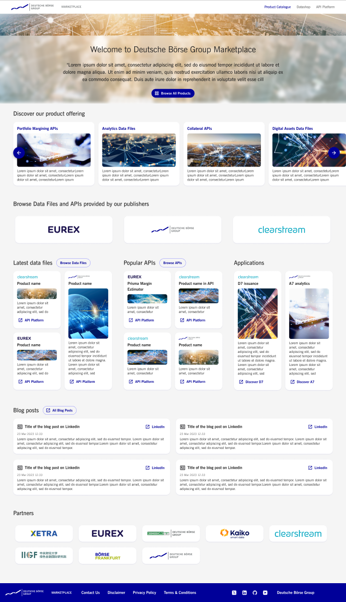
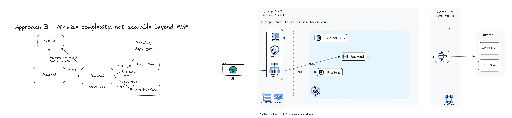
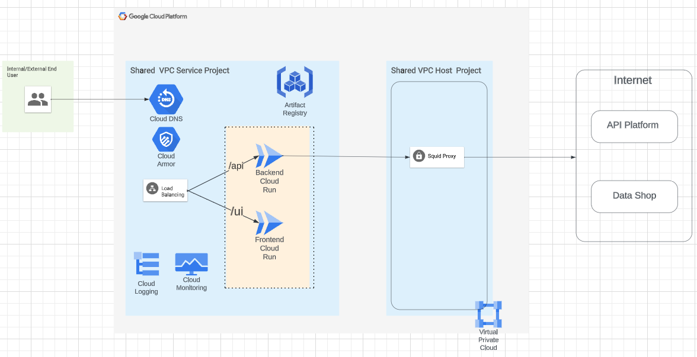
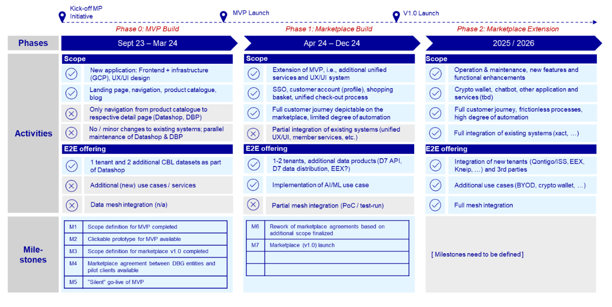
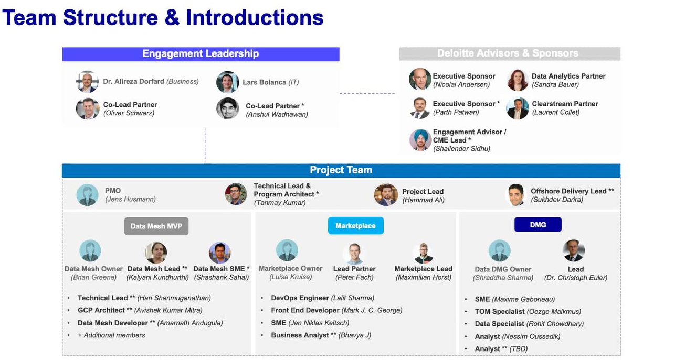

# DBG Marketplace

Welcome to the DBG Marketplace. 
This repository contains the source code for the DBG Marketplace.

## Scope 

The Deutsche Boerse Group Marketplace is a cloud native platform that offers a wide range of data and products to external customers.

For this MVP, the Marketplace is publicly accessible and does not require any registrations or logins to freely browse the catalogue of data files provided by the DBG Datashop and APIs exposed by the DBG API Platform.

For illustration purposes only:

## Architecture - DRAFT

The DBG Marketplace is a cloud native platform that is built on top of the following components:

## Proposed Architecture - DRAFT

In proposed architecture, We are using cloud Run service along with Artifact Registry.

## Getting Started

### Prerequisites

Project Management, requirements and tasks assignments require access to [JIRA](https://jiradbg.deutsche-boerse.de/secure/RapidBoard.jspa?rapidView=3818&projectKey=HYPE&view=detail).

### Methodology - Recommendations

- Focused PRs: PRs should be focused on a single task. If a PR contains multiple tasks, it should be split into multiple PRs. Usually a PR should never be open for more than a couple of days.
- PRs should ideally be reviewed by at least one other person before merging. This is not a hard requirement, but it is recommended.
- Squash commits: PRs should be squashed into a single commit before merging. Recommended as the default merge strategy.
- Use labels: PRs should be labeled with the appropriate labels. This is not a hard requirement, but it is recommended.

### Technology Stack - Recommendations

The DBG Marketplace should be built on top of the following technology stack:

Front-end:
  - Node JS v14.19.0
  - React 18.x and Typescript 5.x (must)
  - Standard 17.x as linter and code checks (alternatives are fine, e.g. prettier)
  - NextJS 12.x as framework but not mandatory (in that case no other framework can be used, but other standard libraries can be used e.g. for routing - upon approval)
  - Jest 29.x (alternatives like karma are fine - upon approval)
  - Styled components 5.x (recommended for desktop)
  - Tailwind 3.x (strongly recommended for responsive)
  - React Query 3.x is used for fetching, caching, sync, and updating server state (recommended)
  - Zustand 4.x is used as a lightweight client state management library (recommended)
  - Forms: Formik 2.x and Yup 1.x but React Hook Forms and Zod are strongly recommended moving forward

Back-end:
  - Go 1.20.4

Infrastructure:
  - Terraform 1.2.5
  - Terraform google provider: 5.x
  - Python 3.8
  - Bash scripts

## Deployment Workflow
- We should maintain separate repositories for Backend and Infrastructure. Development in these repositories will proceed independently.
- The Backend Repository will integrate with Cloud Build to trigger pipelines for image creation on any branch commit. The most recent image will be tagged as 'latest' in the Artifact Registry.
- The Infrastructure Repository will integrate with Terraform Enterprise to execute Terraform on any branch commit. - Terraform will possess a distinct workspace for each branch, with code execution based on the configured variables specific to that environment.
- Code will undergo initial testing in the Dev/Test branch before progressing to the Staging branch, and finally to the Prod branch. Execution of 'terraform apply' in the Prod branch will necessitate manual approval.

### Design System

The current visual design of the DBG Marketplace is based on the [Figma](https://www.figma.com/file/ua04a8taCfXyovn465GwFE/DBG-Marketplace)

## Additional resources

### Roadmap

 

### Work structure

### Contact

- Cloud Platform Engineering Team: https://confluencep1.deutsche-boerse.de/display/CLOUD
- API Platform: api.platform.support@deutsche-boerse.com

### Websites

- Datashop: https://a7-dataplatform.deutsche-boerse.com/
- API Platform: https://developer.deutsche-boerse.com/
